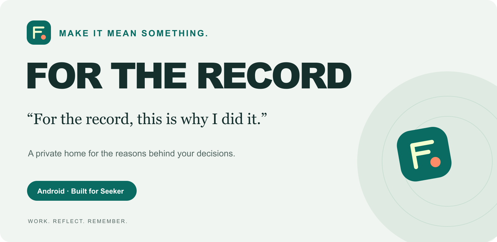

# FOR THE RECORD

> “For the record, this is why I did it.”



A private Android journal for meaningful work and wallet decisions. Keep what you did, why you did it, and the next step worth remembering.

**Version 0.3.0 · CLOCK IN development preview · English by default**

[Submission kit](docs/submission/README.md) · [Pitch](docs/submission/PITCH_CONTENT.md) · [Build instructions](docs/SETUP.md) · [UX review](docs/UX_REVIEW.md)

## One useful loop

1. Create a project without a wallet or account.
2. Write an intention and choose a focus period.
3. Pause or finish when you need to. Record an outcome, including a sticking point.
4. Leave one next action. Pick it up from your home screen next time.

Wallet reflections follow a separate read-only flow: connect an MWA wallet, choose a supported historical swap, and answer four optional prompts — reason, plan, emotion and next action. Personal reflections stay on the device. A transaction's facts cannot be rewritten through the journal.

## Built to feel considerate

- **Eight languages:** English, 한국어, 日本語, 简体中文, हिन्दी, Español, Português and Français. English is the first-run default; your choice persists in Settings. User-written notes are never translated.
- **An original identity:** vector record mark, bold teal/paper typography, a short entrance animation and a matching Android launcher icon. No blocking splash or repeating animation. System and in-app reduced motion are respected.
- **Local first:** SQLite records, no sign-in wall for personal work, recoverable drafts and JSON export.
- **Mobile details:** monotonic time, reboot handling, optional reminders and haptics, scrolling forms, large-text support, visible validation and duplicate-action protection.
- **Honest states:** read-only MWA authorization works without an app account or a paid backend; rate limits and unsupported activity have explicit states. Simulated wallets and trades are confined to tests.

## What is ready, and what is still a release gate?

The default APK runs the local work journal and direct read-only wallet journal without Firebase configuration or billing. MWA supplies the selected public address; the device queries the official Solana mainnet public RPC and parses supported finalized swaps locally. It never requests a message signature or transaction signature in this mode.

**A real Seeker/wallet rehearsal remains required before competition submission.** Automated tests and an Android emulator walkthrough are documented; a successful physical-wallet flow is not claimed. Public RPC is best-effort and may rate-limit or reject traffic. Shared rooms, SGT verification and purchases remain optional server features and are hidden in the default edition. They require a separate configured backend. The preview APK uses a development signing key. See [the free approach](docs/submission/FREE_PREVIEW_APPROACH.md).

The activity parser deliberately accepts only a supported subset of successful Jupiter v6 classic SPL-token swaps. Unsupported, ambiguous and failed transactions remain read-only activity rather than being presented as successful swaps. This is not a complete trading history, trading venue or profit/loss service.

## Run and verify

The project retains the existing Android application ID and SQLite database name so an update can preserve data. Export before replacing an installed preview, and use the same signing key; do not uninstall an existing app just to bypass a signature mismatch.

The verified toolchain is Flutter 3.47.4 / Dart 3.13.3, JDK 17, Android API 36 and Node 22. Package versions are locked. On Windows, the included bootstrap and build scripts configure a local toolchain; read [setup](docs/SETUP.md) before enabling online services.

```powershell
./tools/bootstrap.ps1
./tools/build.ps1 -Release
```

```sh
flutter pub get
flutter analyze
flutter test
pnpm --dir functions install --frozen-lockfile
pnpm --dir functions build
pnpm --dir functions test
```

No environment file is needed for the free default edition. `config/example.json` is only for optional server features. Keep signing keys, passwords, RPC credentials and private notes out of Git. `config/local.json` is ignored.

For isolated Android verification:

```powershell
$env:WORKROOM_ISOLATED_TEST='1'
flutter drive --driver=test_driver/walkthrough.dart --target=integration_test/english_walkthrough_test.dart -d <dedicated-emulator-id>
```

## Competition materials

The [English submission kit](docs/submission/README.md) contains the requirements, official registration link, product description, pitch copy, three-minute demo script, captions and release checklist. The accompanying delivery package contains the pitch deck and media. Required contest materials are an Android APK, GitHub source, demo video and pitch presentation. Verify the final entry's live integration before submitting.

## Privacy and project history

Local notes are not uploaded automatically. The free wallet journal sends only public wallet addresses, transaction IDs and read parameters to Solana public RPC. It does not send notes or project names. Optional server features use wallet addresses and service state; chain transactions are public. Exported files contain your notes and should be stored privately. Cloud backup and import/restore are not implemented; export is an archive, not a one-tap restore promise.

Original architecture and earlier validation are retained in `docs/`. Their dates and versions matter: historical 0.2.0 evidence does not validate 0.3.0. Earlier reference prompts and diagnostic exports remain in the original local archive and are excluded from the published source.

The app was previously named Workroom. Its package identity is `app.workroom.seeker_workroom`; the current product name is **FOR THE RECORD**.
