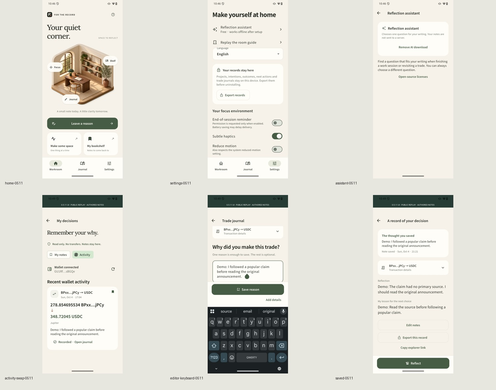

# Product UI cleanup — 0.5.11

This release removes developer-facing copy from the everyday product interface.

- Removed the stale development-preview/version footer and clock implementation explanation from Settings.
- Replaced infrastructure-oriented wallet text with a plain explanation of public activity and private notes. Provider disclosure remains in Privacy.
- Simplified AI setup to the download size, offline availability, setup/removal actions and helpful errors. Model architecture and licensing detail live in the existing license notice.
- Renamed on-chain facts to Transaction details, kept them collapsed, and omitted missing token/fee rows.
- Removed repeated provenance disclaimers from the saved-reason surface. Source data and save timestamps remain intact.
- Kept known input-validation messages, while unexpected exceptions show a helpful retry message rather than raw internal paths or error codes.
- Removed irrelevant purchase-rights copy from the local delete action. The confirmation still describes irreversible loss and export recovery limits.

Privacy, optional download size, deletion confirmation, export completion, source inspection, manual AI question choice and open-source attribution remain accessible. No model, selection policy, parser, database schema, wallet permission, export bridge or token feature changed.

Validation: 155 Flutter tests passed, including ten new product-copy checks, eight supported languages, known validation errors, unexpected error redaction, and large-text layouts. Analysis passed. Changed golden images were inspected. Release packaging and physical-device results are recorded separately with their receipts.

The `tool/product_ui_0511.dart` harness is an isolated debug entrypoint, not part of the production entrypoint. Its public replay and authored notes retain visible evidence labels. Product UI cleanup does not remove those labels from evidence or relabel earlier 0.5.10 AI measurements as newly measured.

Historical evidence: [current 0.5.10 public replay and fresh AI](CURRENT_PROOF_0510.md), [focused security proof](SECURITY_PROOF_0510.md). These retain their original dates, source, scope and limitations. Independent human validation remains open.

## Physical UI and release checks

Both packaged release ABIs passed manifest and required-asset checks. ARM64 was installed in place as versionCode 2018 and launched on Seeker. In a separate no-INTERNET debug package, empty-state home/settings, licenses, privacy and deletion cancellation were checked; public case 8 and authored journal editing/saving were checked with Save visible above the keyboard. The original note timestamp and saved lesson remained visible. No new AI inference, export or current production full flow is claimed. The main app was restored to the foreground.

[Device check receipt](../evidence/ui-0511/checks.json) · [Both package checks](../evidence/ui-0511/package-checks.json).
