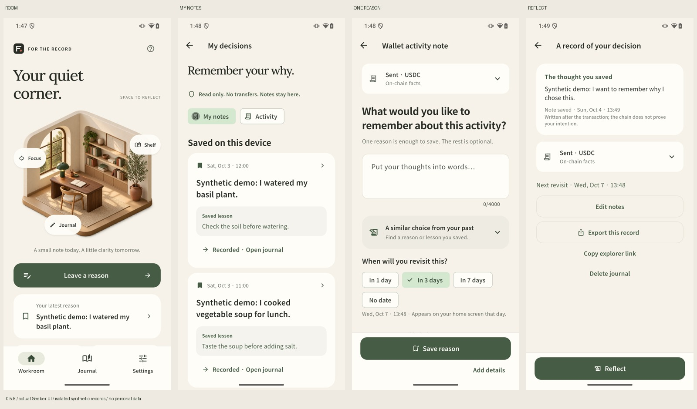

# 0.5.8: make the daily journal easier to use

## Design references and decisions

We consulted Toss's official [eight writing principles](https://toss.tech/article/21022) and [Value first, Cost later](https://toss.tech/article/value-first-cost-later). The useful ideas here are clear next-action labels, fewer competing messages, and making value understandable before asking for work. This is an adaptation for a private reflection app, not a Toss affiliation or a reproduction of its visual identity.

The existing illustrated room, warm paper palette, onboarding and reduced-motion behavior stay. Screens use consistent rounded controls, quieter supporting text, and a clearer primary action. Muted text is darkened; text buttons retain a minimum 48-pixel target. Input surfaces are lighter, and original-record sheets have a visible close control and drag handle.

### Returning to a record

- The journal separates **My notes** from **Activity**. When saved notes exist, they appear first. Readers no longer need to pass the entire activity history to find their own writing.
- Saved cards lead with the original reason and a tinted lesson section. Transaction details remain accessible from the record.
- Home offers the most recent reason directly when there is no due revisit. Due revisits keep priority.

### Writing one reason

- The first question no longer shows a misleading 1/4 progress bar when one reason is sufficient to save.
- **Save reason** is the primary action; **Add details** is secondary. Later questions are explicitly optional.
- Related-record AI is collapsed until requested. It explains the benefit first, then exposes search, its scope, uncertainty, and manual browsing. The retrieval model, thresholds and single-source policy are unchanged from 0.5.7.
- Saved-record **Reflect** is fixed at the bottom. Editing, export and source actions stay in the document body.

## Evidence and boundaries

This is a presentation and navigation change. It does not alter parser classifications, wallet signing, model weights, SQLite schema, original-reason preservation or the export completion implementation. New interface strings are supplied for all eight supported languages. Agent-driven usability checks are not an independent user study.

Regression coverage includes first-reason saving, optional details, source expansion, collapsed related lookup, same-wallet isolation, stale-result invalidation, original-reason-first cards, reachable reflection action, data reload and large text. The 0.5.7 AI measurements remain dated measurements of the unchanged retrieval engine; no new AI accuracy or latency claim is made for 0.5.8.

Presentation/demo evidence must preserve version provenance. Existing 0.5.7 feature footage and 0.5.5 production full-flow footage must not be labelled as 0.5.8. Fresh 0.5.8 UI captures use an isolated package with explicitly synthetic notes and activity, without the user's personal database.

## Completed verification, 4 October 2026

116 Flutter tests passed; static analysis found no issues. All eight golden screens were refreshed and visually reviewed, including small screens and large text coverage. ARM64 and x64 release builds succeeded. Physical Seeker isolated synthetic UI checks covered home to new activity, My notes, one-reason save and the fixed Reflect action. These use MemoryRepository and do not establish production persistence or independent usability research.

