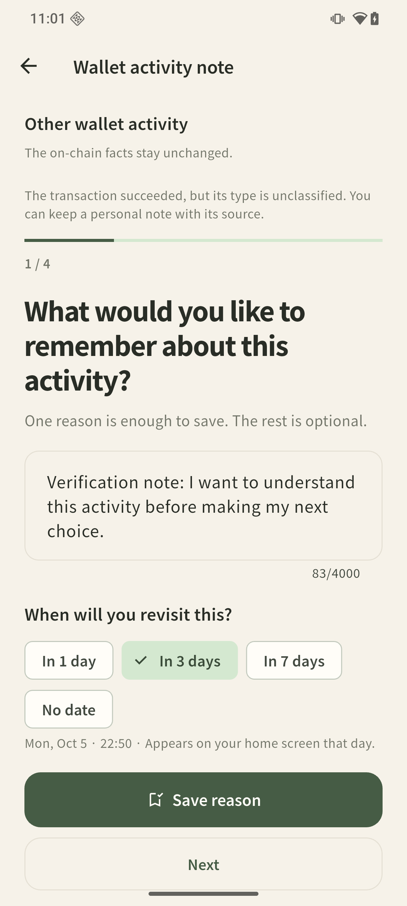
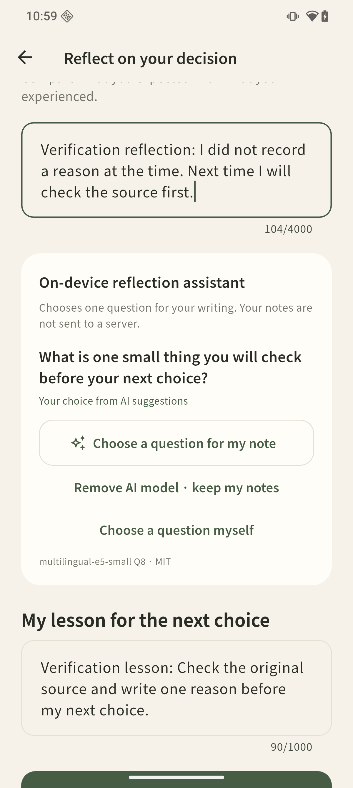
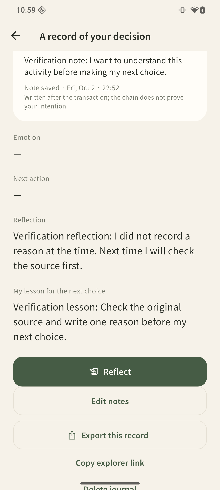

# 0.5.3 · Real Seeker activity can carry a reason

2 October 2026 · Version 0.5.3+10 · Development preview, not a contest submission.

## Feedback addressed

The portal's latest observed Coach score was **50/100** on 2 October, before this
revision was assessed. Its primary gaps were an unreadable deck, a stale demo
transcript, and insufficient proof of the current device flow. The score is not
a rating of 0.5.3. The contest entry remains a draft.

On the actual Seeker, account selection and finalized public activity retrieval
worked, but the returned transactions were outside the narrow supported swap
subset. The user could not start a record. This revision removes that dead end.

## Changes

- Confirmed successful activity with an unclassified type can hold a personal
  note. The immutable source stays `type: other`, `issue: unsupported-activity`,
  with no inferred input/output amounts. It is never relabeled as a swap.
- The action says **Add a personal note**, the page says **Wallet activity note**,
  and the first question asks what the person wants to remember about the activity.
- The original reason, later reflection, AI question, lesson, source link, due
  date and JSON export use the existing journal flow. Lesson source labels also
  work when token inputs/outputs are absent.
- Failed, unavailable, parse-error and unverified generic activity remain
  ineligible. The conservative Jupiter parser and its `canJournal` contract
  were not broadened.
- All new interface strings have eight language routes. The room, welcome pages,
  application ID and SQLite schema remain compatible with existing records.

## Verification performed

| Check | Result and scope |
| --- | --- |
| Flutter suite | **102 passed**, including new generic-note persistence, rejection and widget-flow cases |
| Static analysis | **No issues found** |
| Android build | ARM64 and x64 normal release APKs built; development signing |
| Physical device | Normal 0.5.3 APK on Seeker, versionCode 2010, installed as an update |
| Wallet and RPC | Seed Vault account connection and actual historical public activity read, no signature or transfer |
| Real activity → note | Successful unclassified activity saved with explicitly authored verification text |
| Revisit | Opened manually immediately; no claim that three days elapsed or a due reminder fired |
| AI | Native E5 Q8 inference; final-build cold request **2,099 ms**, two candidates, explicit human choice |
| Persistence | Original source/reason and first completion timestamp preserved; reflection and lesson survived process restart |
| Export | Android's native file picker saved one record; locally parsed JSON preserved source, writing and AI-choice metadata |

The AI latency is a single observation with a prepared model. The first test
build, before a copy-only correction, measured 1,929 ms cold. Neither is a new
offline benchmark or a general accuracy claim. Historical offline timing and
authored evaluations remain dated 0.5.1 in [ON_DEVICE_REFLECTION.md](../ON_DEVICE_REFLECTION.md).

Private addresses, transaction identifiers and raw exported financial records
are excluded from the public evidence. The screenshots show authored verification
writing only. The 45-second device recording shows AI inference and its ambiguity
choices; it is not a complete wallet connection or live trade recording.

## Current device screens

| Personal note | AI suggestions | Saved reflection and lesson |
| --- | --- | --- |
|  |  |  |

## Reproduce on a personal Seeker

1. Update the ARM64 APK with the same signing key; never uninstall to bypass a
   signing error. Existing local notes remain available without a wallet.
2. Open **Leave a reason** and connect the selected wallet through MWA. No message
   or transaction signature is needed in the default edition.
3. Use **Write reflection** for a recognized swap or **Add a personal note** for
   successful unclassified activity. The latter makes no claims about trade type.
4. Save one reason and a revisit date. Reopen **Recorded · Open journal** and
   choose **Reflect** for an immediate manual review.
5. With the optional model already prepared, choose a question. If two directions
   fit, select one yourself. Write a reflection, a lesson, or both and save.
6. Use **Export this record**. Keep financial source details private. Restart the
   app and reopen the saved note without reconnecting the wallet.

## Remaining limits

- This is a live unclassified-activity note flow, **not a verified live Jupiter
  swap flow**. The separate supported-swap emulator fixture remains labeled
  synthetic and uses the production parser with temporary SQLite.
- No new transaction, payment, SKR entitlement or SGT verification was performed.
  SKR remains future work and is not claimed for an SKR prize.
- No interviews, retention, adoption, profits or general AI accuracy are claimed.
- The model is optional and takes 132,439,008 bytes once; it retrieves authored
  questions, rather than generating an answer. Users write their own conclusions.
- Public RPC is best-effort. Store signing and production distribution remain open.
- The earlier partial repository audit is not a complete security clearance.
  See [backend status](../BACKEND_SECURITY_STATUS_2026-10-01.md) for remaining
  dependency advisories and the undeployed optional backend.
- Portal saving is still blocked by an existing GitHub installation that the
  portal does not recognize. New artifacts do not imply the draft was saved or
  the Coach rerun. Final contest submission is not authorized.
