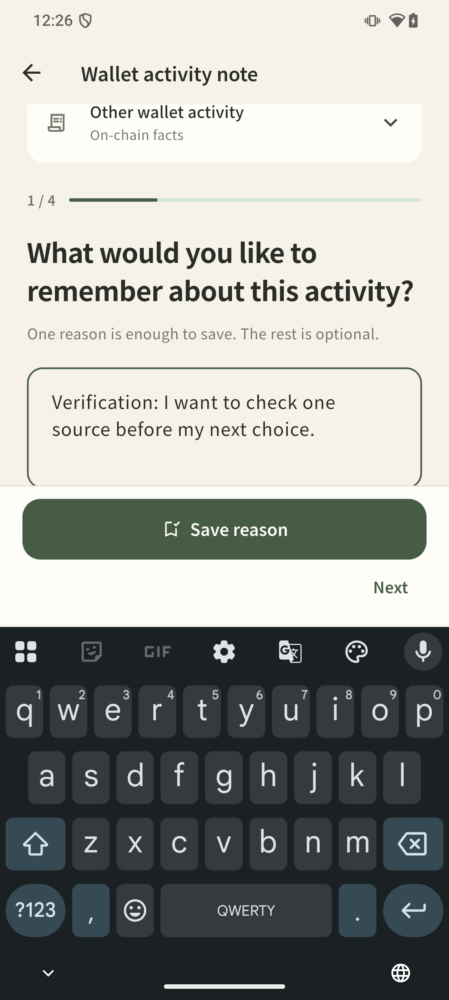
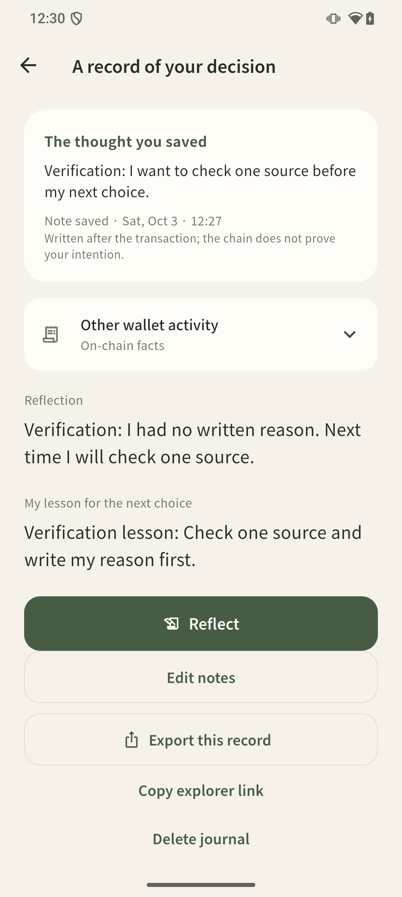

# 0.5.4 — clearer journal screens

The room identity and private local records are preserved. This revision refines activity cards, writing, source disclosure, saved-record hierarchy and the local AI panel using [documented UI rules](../UI_REFINEMENT_2026-10-03.md).

## Verified on a physical Seeker, October 3

- In-place normal APK update to 0.5.4+11, ARM64 versionCode 2011. Existing records remain.
- Read-only Seed Vault account connection and actual public RPC activity retrieval.
- Authored verification note on a successful **Other** activity. It was not a supported Jupiter swap.
- Save stays visible above the keyboard. Source information is collapsed by default.
- Immediate manual reflection, local AI suggestions, explicit question selection and lesson save.
- One prepared-model cold inference: **2,248ms**, candidates 4 and 1, human selected 4. Network was available. This is one observation, not a general accuracy or offline benchmark.
- Force-stop/relaunch and reopening the record retained the original reason, reflection and lesson.
- Native Android JSON export completed and its content was checked privately. The first export attempt was interrupted by the test operator force-stopping the app before the picker result finished, producing an empty file. A subsequent export waited for the app to resume and produced valid JSON. Do not claim that the initial continuous recording proves a completed export.

The raw recordings and JSON contain wallet/transaction identifiers and are excluded from publication. Public screenshots below contain only authored verification text and collapsed source details. No signature, transfer, payment, live swap, delayed revisit, or real-user research is claimed.

## Screens

### Writing with the keyboard open

### Saved reason, reflection and lesson

## Checks and current competition state

103 Flutter tests passed, static analysis clean, ARM64 and x64 normal release builds succeeded. Automated checks include 360px layouts and eight languages at 200% text, plus a dedicated keyboard-aware Save/source disclosure regression.

Last observed AI Coach result remains **62/100 on October 2**, for 0.5.3 materials. This UI revision has not yet been reassessed. Public slides/video still describe 0.5.3 until explicitly replaced. Final submission is forbidden and the project remains DRAFT. The partial historical code audit and unresolved backend advisories remain as previously documented.
